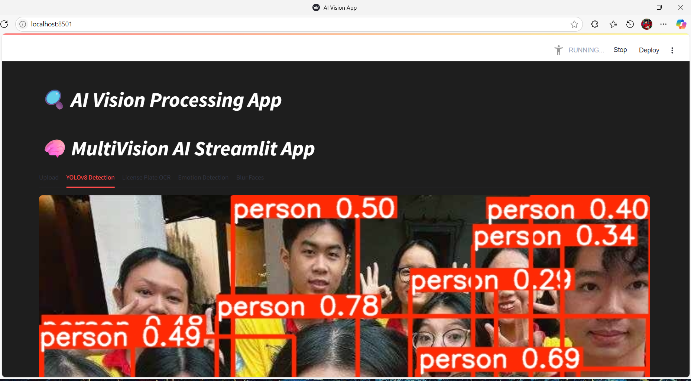

# 🧠 AI_Multivision_App – Streamlit-based AI Vision Toolkit
A lightweight AI computer vision app built with **Streamlit** that combines multiple real-world vision tasks: **YOLOv8 object detection**, **license plate OCR**, **emotion detection**, and **face blurring** — all wrapped in a user-friendly web interface.


---

## 📌 Table of Contents

1. [✨ Project Overview](#-project-overview)  
2. [🚀 Features](#-features)  
3. [🗂️ Project Structure](#-project-structure)
4. [🧰 Tech Stack](#-tech-stack)
5. [⚙️ Installation](#-installation)
6. [✅ Feature Details](#-feature-details)
7. [🧠 How It Works)](#-how-it-works)
8. [🧪 Known Issuess](#-known-issues)
9. [📈 Future Enhancements](#-future-enhancements)  
10. [📄 License](#-license)
11. [🤝 Contributing](#-contributing)
12. [📬 Contact](#-contact)

---

## ✨ Project Overview

### 1. This app is designed to:
- Leverage **YOLOv8** for detecting general objects and faces.
- Perform **OCR** on **license plates** of vehicles with contour-based heuristics.
- Recognize **facial emotions** using a fine-tuned **ResNet18 CNN**.
- Provide **face anonymization** via Gaussian blur.

### 2. Accessible via Streamlit for demo or educational purposes.

---

## 🚀 Features

| Feature Name                         | Description                                                | Technique/Model Used                                  |
|--------------------------------------|------------------------------------------------------------|--------------------------------------------------------
| **YOLOv8 Detection**              | Real-time object detection for general scenes                         | ``YOLOv8n.pt``                 |   
| **License Plate OCR**   | Detect & extract text from Vietnamese plates                           | YOLOv8 + EasyOCR + Contour Heuristics                      |
| **Emotion Detection**                    | Predict facial emotion from detected faces                               | ResNet18 (trained on FER2013)           |
| **Face Blurring**                | 	Auto-detect and anonymize faces for privacy              | YOLOv8-Face + Gaussian Blur        |


---
## 🗂️ Project Structure
```
├── ai_multivision_app.py           # Main Streamlit app logic
├── train_emotion_model.py          # Script to train ResNet emotion model
├── emotion_resnet18.pth            # Trained model weights for emotion detection
├── yolov8n.pt                      # YOLOv8 base model
├── yolov8n-face.pt                 # YOLOv8 face detector
├── license_plate_detector.pt       # (Optional) Custom license plate YOLOv8 model
├── static/
├── requirements.txt                # Python dependencies
└── README.md
└── LICENSE

```
---

## 🧰 Tech Stack

| Purpose                  | Libraries/Models Used                                       |
|--------------------------|-------------------------------------------------------|
| **Detection**        | ``	ultralytics`` (YOLOv8)                            |
| **OCR**       | ``easyocr``, ``OpenCV``, ``contours``                                 |
| **Emotion Detection**              | ``PyTorch``, `FER2013`, `ResNet18`  |
| **Face Blurring**       | ``cv2``, ``YOLO`` ``haar cascade``                                    |
| **Web Interface**    | ``Streamlit``, ``Pillow``, ``matplotlib``  |


---

## ⚙️ Installation

```bash
# Clone the repo
git clone https://github.com/paht2005/AI_Multivision_App.git
cd AI_Multivision_App

# Install dependencies
pip install -r requirements.txt

# Run the app
streamlit run ai_multivision_app.py


```
Then open your browser: ``[http://127.0.0.1:5000](http://localhost:8501)``

---

## ✅ Feature Details

### 1. YOLOv8 Object Detection
- Uses ``yolov8n.pt`` to detect COCO objects.
- Simple call to ``yolo_model(image)`` and plotting via ``.plot()``.
### 2. License Plate Recognition
- Steps:
    - **Upscale** input image.
    - Use YOLOv8 to detect **vehicles only**.
    - Apply **contour detection** inside cropped vehicle ROI to locate plate-like boxes.
    - Run **EasyOCR** on those contours.
- Heuristics: Ratio 2–6, width 80–400px, height 25–150px, min confidence > 0.5
### 3. Emotion Detection (CNN)
- Combines YOLOv8-face and Haar Cascade to detect as many valid face ROIs as possible.
- Filters out small, elongated, or irrelevant boxes.
- Extracts grayscale face, resizes to 48×48, runs through ``ResNet18``.
- Output class among: ``Angry``, ``Disgust``, ``Fear``, ``Happy``, ``Sad``, ``Surprise``, ``Neutral``.
### 4. Face Blurring
- Uses ``yolov8n-face.pt`` to find faces with ``conf=0.3``.
- Applies ``cv2.GaussianBlur()`` with strong parameters (99×99) to obfuscate.
- Skip blurring on low-size regions (w/h < 30).


---
##  🧠 How It Works


### 1. YOLOv8 Architecture
- YOLOv8 is a real-time one-stage detector from Ultralytics.
- Internally processes images as:
  - Resized to square
  - Encoded into **feature pyramids**
  - Uses anchor-free detection heads
  - Outputs class + confidence + bounding box (xyxy)
- **Thresholds:**
  - Confidence (``conf=0.25``) controls minimum detection probability.
  - IOU (``iou=0.3``) determines overlap during NMS.

### 2. Text-to-Speech (TTS) Answering
- **Input:** Text string generated or typed by the user
- **Process:**
  - A **Tacotron2** model (or similar) converts text to a **mel-spectrogram**.
  - A **vocoder** (e.g., HiFi-GAN, WaveGlow) synthesizes audio from the spectrogram.
  - Optionally, the voice output is adjusted using a **cloned speaker embedding**.
- **Output:** ``tts_output.wav`` file saved in ``/static/`` directory

### 3. Emotion Pipeline
```bash
Input → YOLO/haar → Face crop → Resize to 48x48 → Normalize → CNN → Softmax → Label

```
- Trained using ``FER2013.csv`` with heavy augmentation. Download dataset fer2013.csv on Kaggle
- Training code in ``train_emotion_model.py``

--- 
## 🧪 Known Issues

| Issue                         | Reason                      | Fix or Tip                                                               |
|-------------------------------|-----------------------------|-------------------------------------------------------------------------
| **❌ License plate not detected**  | Low res / angle too sharp                     | Try high-res images or fine-tuned YOLO                                          |   
| **⚠️ Wrong emotion on profile face**    | Face angle/size unsuitable     | Use more frontal face                                         |
| **❌ YOLO doesn't detect all faces**  | Model confidence threshold too high        | Reduce ``conf=0.3``, or combine with Haar                                             |


--- 
## 📈 Future Enhancements
- Train custom YOLOv8 model for specific license plates
- Add bounding box visualization for plates
- Integrate real-time webcam stream support
- Add face recognition / anonymization toggle
- Add Vietnamese UI translation support
---
## 📄 License
This project is licensed under the MIT License. See the [LICENSE](./LICENSE) file for details.


---
## 🤝 Contributing
I welcome contributions to improve this project!
Feel free to fork, pull request, or open issues. Ideas welcome!


--- 
## 📬 Contact
- Contact for work: **Nguyễn Công Phát** – congphatnguyen.work@gmail.com
- [Github](https://github.com/paht2005) 
